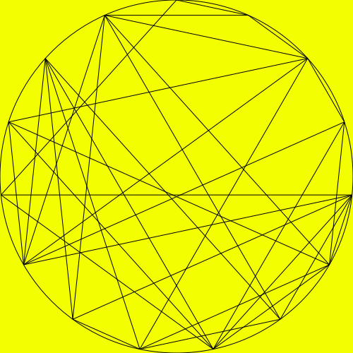

# yatsko-design

Draws the designs from Jacob Yatsko's video [_A New Way to Look at Fibonacci Numbers_](https://www.youtube.com/watch?v=o1eLKODSCqw) as SVGs.

```
usage: yatsko-design.py [-h] [-f FACTOR] [-s SIZE] -m MODULUS -o OUTPUT

optional arguments:
  -h, --help            show this help message and exit
  -f FACTOR, --factor FACTOR
                        the factor to multiply Fibonacci sequence items by before taking the modulo, default: 1
  -s SIZE, --size SIZE  the dimensions of the square output SVG, default: 500

required named arguments:
  -m MODULUS, --modulus MODULUS
                        the modulus for taking the remainder of Fibonacci sequence items
  -o OUTPUT, --output OUTPUT
                        the filename of the output SVG
```

## Example

```
./yatsko-design.py -m 15 -o examples/15.svg
```


